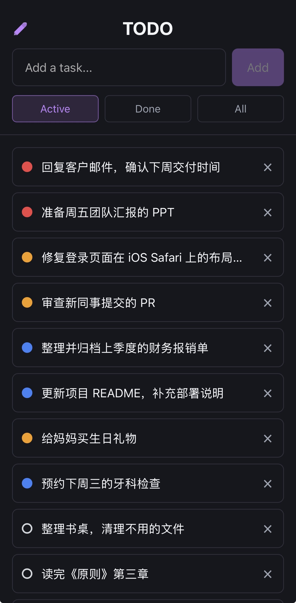
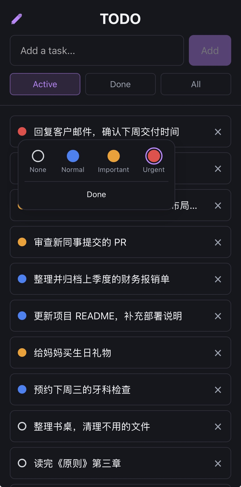
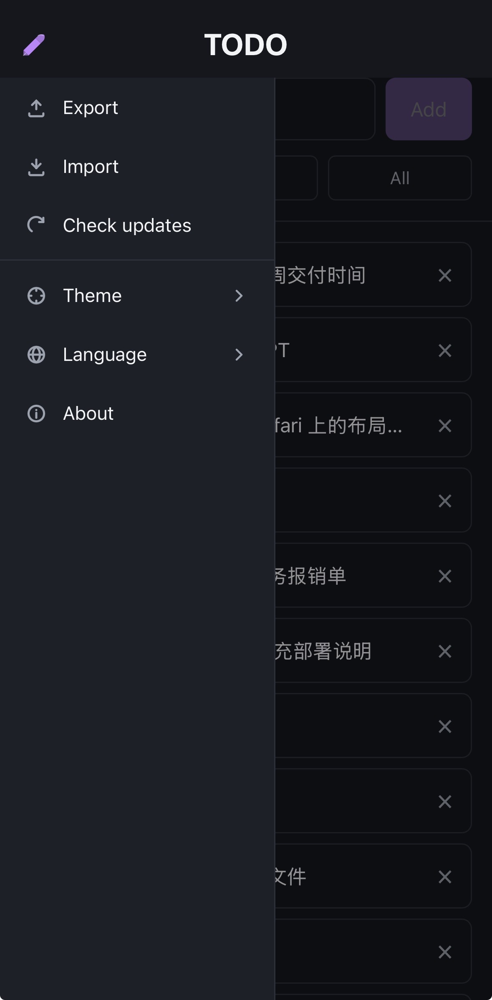

# Todo App

基于 Vue 3 + Vite + Pinia 的移动端 Todo 应用，支持中英文切换、优先级标记、导入/导出，可作为 PWA 离线使用。

[English](README.md)

## 截图

<p align="center">
  
  
  
</p>

## 运行

```bash
npm install
npm run dev        # 开发服务器，端口 3071，局域网可访问
```

启动后终端会显示 `Network:` 地址，同一 WiFi 下的手机可直接访问。

## 打包

```bash
npm run build      # 生产构建 → target/dist/
npm run preview    # 本地预览生产构建
```

## 功能

- 添加、双击编辑、删除待办
- 四级优先级彩色圆点标记：无 / 普通 / 重要 / 紧急
- 按状态筛选：未完成 / 已完成 / 全部
- 侧边菜单：导出 JSON、导入 JSON、检查更新、主题、语言、关于
- 主题切换：跟随系统 / 浅色 / 深色（持久化）
- 中文 / English 界面（自动识别浏览器语言）
- PWA：可安装到主屏，离线可用（Workbox 预缓存 + Cache API 缓存运行时配置）
- 数据持久化到 `localStorage`，刷新不丢失

## 技术栈

- Vue 3 `<script setup>` SFC
- Vite 8
- Pinia（状态管理，数据持久化到 localStorage）
- `vite-plugin-pwa` + Workbox
